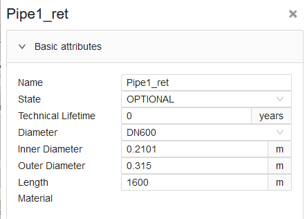
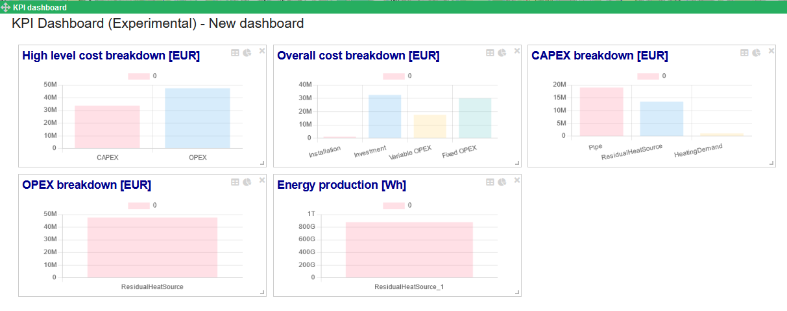
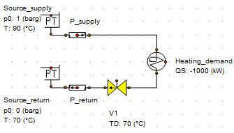
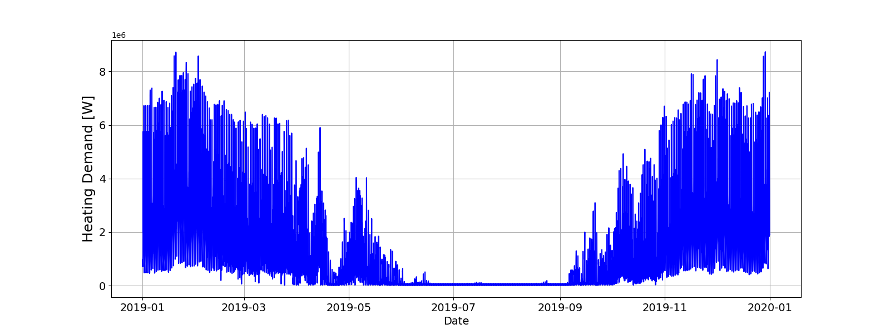
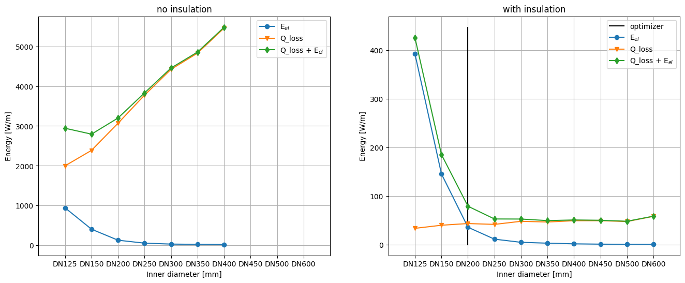
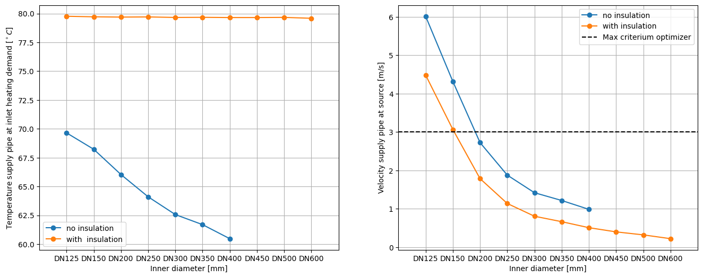
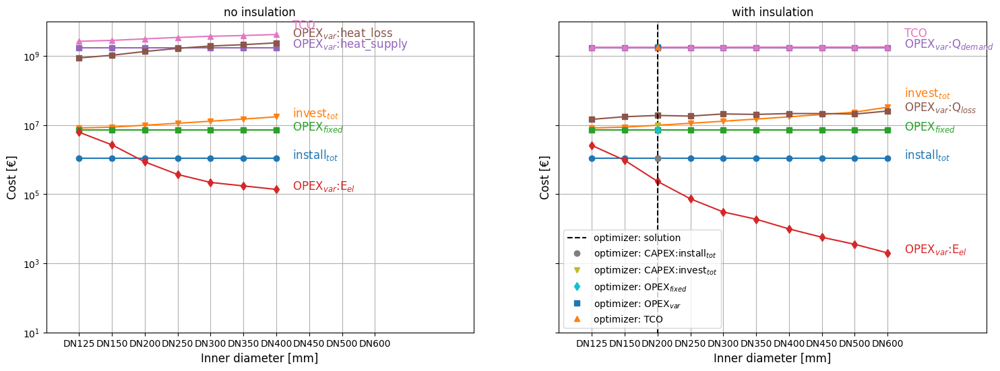

.. _sec_V_pipe_D:

Pipe diameter sizing
====================

This chapter describes the (physical) validation of sizing the pipe diameter in a network. It also provides an overview
of the assumptions made for the Optimizer in the current version of the Design Toolkit (PoC optimizer of January 23 2024)
with respect to the sizing of the pipe diameter in a network. We only consider here networks that contain sources, demands and pipes. We do not consider storage.

Please note that the Toolkit is currently in active development, and as such, certain assumptions may be subject to refinement over time. 
Our aim is to maintain transparency regarding these assumptions and their implications on optimization results. 
By providing clear insights into the assumptions made, we empower users to interpret and understand the outcomes effectively, enabling informed decision-making based on the results obtained.

.. _sec_V_pipe_D_assumptions:

Assumptions
-----------

Chapter :ref:`chp_approach` states that "For operational optimization high priority is given to a stable, robust,
and fast model over a perfectly accurate one." To accomplish this, one cannot model practice accurately and thus has
to make assumptions.
Nevertheless, it is necessary to know the assumptions made as well as what they mean in terms of accuracy.
For that reason, we list the assumptions made in the current PoC optimizer (date of writing is January 23 2024)
implemented for optimizing pipe diameters in a network. We distinguish between different categories.

.. _subsec_V_Pipe_basic_attributes:

Pipe basic attributes
^^^^^^^^^^^^^^^^^^^^^

There are multiple ways to specify pipe properties like the inner diameter and
pipe/insulation material and thickness in the "basic attributes" input list of the esdl pipe assets in the ESDL Map Editor. 
:numref:`ESDL_model_pipe_basic_attributes` shows the basic attributes of a pipe asset.

.. _ESDL_model_pipe_basic_attributes:

    Screenshot of the basic attributes (input parameters) of the ESDL Pipe asset.

Even though the user has currently freedom to fill in all sorts of input parameters for the pipes,
the optimizer routine takes precedence over some user specified parameters than others. We list them here:

* If the user specifies a nominal diameter (DN size), "Diameter", it takes precedence over potential user specified "Inner Diameter".
* If the user specifies a non-zero "Diameter", the insulation and inner diameter properties from the EDR asset library for Steel S1 library for that DN size will be used (more on this in :ref:`subsec_V_Pipe_classes`), otherwise the inner diameter is fixed and won't be optimized. 
* If the user specifies no DN size ("Inner diameter") or "Inner Diameter" or a "Material" specified, the diameter and insulation properties of the DN200 in EDR asset library for Steel S1 pipes are used. However, the routine will determinate the optimization with an error, so best is to specify a DN size.
* If the user specifies no a "Diameter" or "Inner Diameter", but a "Material", the insulation thicknesses and conductivities are taken from esdl references (esdl.MatterReference & esdl.CompoundMatter) instead from the Steel S1 library.
* If the user specifies no insulation thickness, so no "Material" or "pipe class", the solver assumes that the thickness is equal to half the inner diameter of the pipe.
* The optimizer routine does not consider any specified "Outer Diameter" by the user. Instead it assume that the outer diameter is the "Inner Diameter" plus the sum of the thicknesses of all insulation layers.
* The minimum length of a pipeline is 25 m. If a user specifies a shorter length in the model set-up, the optimizer assume that those pipes have a length of 25 m.

Important to note is that:

* The optimizer routine assumes that the pipes always come in pairs: one supply pipe and one return pipe that are placed parallel to each other in the subsoil. 
* The optimizer routine only optimizes the pipe diameter if the both the supply and the return pipe of a pipe pair is set to "optional". The routine will determinate the optimization with an error if only one pipe in a pair has been set to "optional".
* The minimum specified DN size in a pipe pair by the user is the maximum DN size considered by the optimizer routine. 
    * Thus, the result for the diameter of a pipe pair can only be that specified DN size or one of the smaller sizes from the EDR asset library for Steel S1 library.
    * For example, if the user specifies DN1000 for the supply pipe and DN500 for the return pipe in a pipe pair, the maximum considered DN size is DN500.

.. _subsec_V_Network_topologies:

Network topologies
^^^^^^^^^^^^^^^^^^

The optimizer routine assumes that the pipes always come in pairs: one supply pipe and one return pipe that are placed parallel to each other.
This means that the return line cannot have a different routing than the supply line.
Also, when optimizing the pipe diameters, the optimization result is that the supply and return pipe in a pair have the same diameter.

.. _subsec_V_Pipe_classes:

Pipe classes
^^^^^^^^^^^^

The optimization routine determines what is the "optimal" diameter for a certain pipe.
The optimal solution depends on many parameters.
Also, not all properties are the same in practice if you only vary the diameter.
Think about the thickness of the insulation that typically scales with the pipe diameter.

The current optimizer routine optimizes the diameter of pipes based on pipe properties from the `ESDL Energy Data Repository (EDR) <https://edr.hesi.energy/cat/Assets>`_.
Currently, the optimizer routine only supports for the Steel-S1 class from the `Logstor catalog <https://www.logstor.com/media/6506/product-catalogue-uk-202003.pdf>`_. It contains pipe properties for bonded pipe systems of district heating pipes
with insulation series 1.  
These pipes are steel pipes with a PUR layer for insulation and a PE casing.

.. improve: allow user to specify insulation class: 1, 2 or 3.

The library contains the following properties for several DN sizes:

* **name**: Type of material inner pipe - insulation class - DN size.
* **inner_diameter**: inner diameter of the pipe [m].
* **u_1**: thermal transmittance (i.e., U-value) 1 [Wm\ :sup:`-2` K\ :sup:`-1`].
* **u_2**: thermal transmittance (i.e., U-value) 2 [Wm\ :sup:`-2` K\ :sup:`-1`].
* **insulation_thicknesses**: ordered list (from inner layer outwards) of thicknesses of the insulation layers in [m].
* **conductivities_insulation**: ordered list (from inner layer outwards) of conductivity in [W/mK].
* **investment_costs**: combined installation and investment cost [€/m].

The optimizer routine assumes that the conductivity values of the insulation layers do not depend on temperature.
In general, the conductivity for PUR increases over time. This is not taken in account but the lifetime average is assumed.

The properties for the different insulation classes can be found in Chapter :ref:`chp_logstor`.

.. _subsec_V_Network_temperatures:

Network temperatures
^^^^^^^^^^^^^^^^^^^^

Regarding network temperatures (supply and return) the optimizer routine assumes the following:

* The user provides network temperatures as input variables by setting one "carrier" with a certain temperature to all supply pipes and one "carrier" with a certain temperature to all return pipes. 
* A decoupled hydraulic network has only one supply and one return temperature. Thus it is not possible that different sources supply flow to the network at different temperatures.
* The supply carrier and return carriers' temperatures are fixed throughout the optimization.  
* Calculations are done for the relative heat between the supply and return lines. This relative heat is only transported over the supply line.
* The network temperature should be in the range 20 to 130 :math:`^\circ C`.

.. The default temperature is 0.0?

.. _subsec_V_Flow:

Flow
^^^^

Regarding flows, the optimizer routine assumes the following:

* Minimum flow velocity, :math:`v_{min}`, is 0.0 m/s.
* Maximum flow velocity, :math:`v_{max}` is 3.0 m/s. Not that this assumption accounts for all diameters, while in practice, small DN sizes (like DN40, DN50, DN65) have lower maximum velocity criteria.
* Maximum discharge is computed based in the maximum velocity, thus :math:`\dot{V}_{max}` =  :math:`v_{max} A`, with :math:`A` the cross-sectional area of the pipe.

The minimum flow velocity of 0.0 m/s means that return flows are not allowed. 
Also, the routine assumes that flow directions are the same as the heat directions if the return line has zero heat throughout.

.. _subsec_V_Head_losses:

Head loss
^^^^^^^^^

The optimizer routine assumes that no head loss over the pipe, thus :math:`\Delta H = 0` m.
However, in practice the smaller the pipe diameter, the larger the losses and the more it costs to pump. 
And not only that, the rule of thumb is that the pressure loss over a pipe may not exceed 100 Pa/m for the main lines of heating networks, 
which gives a good balance between heat loss and pumping costs. Instead the routine limits the velocity of the flow instead of the 
pressure drop as indicates in Section :ref:`subsec_V_Flow`.

Not accounting for the head loss means that the length of the pipe only influences the investment and/or installation costs and no pumping costs 
are included in the optimization.

Even though head losses are not considered, but for completeness we note that the optimizer routine assumes a wall 
roughness, :math:`e`, of 0.0002 m for all pipes.

.. _subsec_V_Heat:

Heat
^^^^

* The maximum heat, :math:`Q_{max}`, transported is determined based on the assumed maximum discharge: 

.. math::
    :label: Q_max_pipe_optimizer

    Q_{max} =  \rho \dot{V}_{max} c_p \left( T_s - T_r \right)

In which:

    :math:`T_s`: Temperature of the flow in the supply pipe [K]

    :math:`T_r`: Temperature of the flow in the return pipe [K]

    :math:`\rho`: Fluid density [kg/m\ :sup:`3`]

    :math:`c_p`: Fluid specific capacity [J/kg K]

Note that due to the fact that the optimizer routine applies a maximum criteria for the velocity in the pipe, see :ref:`subsec_V_Flow`, it cuts off the amount of heat that can be transported through the supply pipes.
The user needs to be especially aware of this when specifying the maximum DN size for which the optimizer routine needs to size the pipe diameters. More information in subsection :ref:`subsec_V_Pipe_basic_attributes`.

.. _subsec_V_Fluid_properties:

Fluid properties
^^^^^^^^^^^^^^^^

* Constant density :math:`\rho` = 988 kg/m\ :sup:`3` (thus regardless the temperature). This density corresponds to a water temperature of about 50 :math:`^\circ C`.
* Constant specific capacity :math:`c_p` = 4200 J/kg K (thus regardless the temperature). This specific heat corresponds to a water temperature of about 85 :math:`^\circ C`.

.. _subsec_V_Ground_properties:

Ground properties
^^^^^^^^^^^^^^^^^

The conductivity for the ground or soil is influenced a lot by all different factors depending on the type of soil and
for example moist level. The NEN norm specifies that usually a value between 1.5 - 2 W/mK is used for wet soil and about 1.0 W/mK for dry soil.
By default, the optimizer routine assume a value of 2.3 W/mK for the conductivity of the soil.
Moreover, it assumes that the temperature of the soil, :math:`T_g` = 10.0 :math:`^{\circ} C`.

.. _subsec_V_Pipe_conf_subsoil:

Pipe configuration in subsoil
^^^^^^^^^^^^^^^^^^^^^^^^^^^^^

The optimizer routine assumes that the pipes always come in pairs: one supply pipe and one return pipe that are placed parallel to each other in the subsoil.
It also assumes that the supply and return pipes have the exact same properties.
As the user, in the current version, cannot specify a distance between the two parallel pipe, it assumes that the distance from center to center,
:math:`C`, twice the outer pipe diameter, :math:`D_{outer}` is, i.e:

.. math::
    :label: distance_pipes_optimizer

    {C} = 2 D_{outer}

With other words, it assumes that the is a distance of one pipe outer diameter between the supply and the return pipe in a pipe pair.

Furthermore, the optimizer assumes that the pipes are buried and the depth of burial to the top of pipe, :math:`z^{\prime}`, is 1.0 m.
Users cannot specify the depth of burial to the top of pipe themselves in the current version.
The depth of burial to the center of pipe, :math:`z`, is computed by

.. math::
    :label: depth_pipes_optimizer

    {z} = z^{\prime} + 0.5 D_{outer}

.. _subsec_V_Heat_losses:

Heat losses
^^^^^^^^^^^

The optimizer considers three types of heat losses in the pipelines,
in accordance to the NEN-EN 13941+A1 :cite:p:`NEN-EN13941+A1`. 
These are the heat losses through:

* The pipe wall
* Subsoil
* Neighboring pipelines

The optimizer routine does not account for losses at the surface (interface subsoil and the atmosphere).
However, for completeness, we mention here that it does assume a heat transfer coefficient at surface of 15.4 W/m\ :sup:`2`/K

The optimizer computes the heat loss, :math:`Q_{loss}` as 

.. math::
    :label: heatloss_pipe_optimizer
    :nowrap:

    \begin{align}
    {Q_{loss}} =  Q_{loss,sup} + Q_{loss,ret} = \\
    L\left( {{U_1} - {U_2}} \right)\left( {{T_s} - {T_g}} \right) + L{U_2}\left( {{T_r} - {T_g}} \right) +
    L\left( {{U_1} - {U_2}} \right)\left( {{T_r} - {T_g}} \right) + L{U_2}\left( {{T_s} - {T_g}} \right)
    \end{align}

In which:

    :math:`L`: Length of pipeline (supply or return) [m]

    :math:`T_g`: Temperature at ground temperature at depth :math:`z` [K]

    :math:`U_1, U_2`: thermal transmittance 1, 2  [Wm\ :sup:`-2` K\ :sup:`-1`]

The heat loss coefficients :math:`U_1` and :math:`U_2` are be calculated from:

.. math::
    :label: heatloss_pipe_u1_optimizer

    {U_1} = \frac{{{R_g} + {R_{ins}}}}{{{{\left( {{R_g} + {R_{ins}}} \right)}^2} - R_m^2}}

.. math::
    :label: heatloss_pipe_u2_optimizer

    {U_2} = \frac{{{R_m}}}{{{{\left( {{R_g} + {R_{i}}} \right)}^2} - R_m^2}}

In which:

    :math:`R_g`: Subsoil heat resistance [mK/W]

    :math:`R_{ins}`: Insulation heat resistance [mK/W]

    :math:`R_m`: Heat resistance due to neighboring pipeline [mK/W]

As the description above shows, :math:`U_1` and :math:`U_2` are constant values based on type, placement en dimensions of the pipelines.

The optimizer routine neglects the heat resistance due to convection inside the pipe, i.e. it assumes perfect mixing,
or that this resistance is much lower than the resistance of the outer insulation layers.
With other words, the heat loss is only a function of the temperature difference between the supply and return pipe, which are assumed to be constant over time.
Thus, the heat loss does not depends on the flow rates or the amount of heat transported during a certain amount of time.

The insulance of the soil is determined by:

.. math::
    :label: heatloss_pipe_Rg

    {R_g} = \frac{1}{2 \pi \lambda_g} ln\left(4 z / D_{outer}\right)

In which:

    :math:`\lambda_g`: the coefficient of thermal conductivity for the subsoil [W/mK]

    :math:`z`: the depth of the center of the pipe [m]

Note that, other than in the optimizer routine, the NEN norm uses a corrected value of depth :math:`z`, so that the surface transition insulance :math:`R_o`
at the soil surface is included

.. math::

    Z_c = z + R_o \lambda_g

:math:`R_o` can usually be valued at 0.0685 m²K/W. 

The heat resistance due to insulation material is computed as the sum over all insulation layers, carrier pipe and outer casing materials:

.. math::
    :label: heatloss_pipe_Ri

    R_{ins} = \sum_i (\frac{1}{2 \pi \lambda_i} ln\frac{D_{outer,i}}{D_{inner,i}} )

in which the inner and outer diameters are those of each layer.

Finally, the heat resistance due to neighboring pipeline is computed as

.. math::
    :label: heatloss_pipe_Rm

    R_m = \frac{1}{4 \pi \lambda_g} ln\left(1 + (\frac{2z}{C})^2\right)

In which:

    :math:`C`: is the distance between the center of the pipes [m].

Assuming that all temperatures supply and return temperatures are fixed (no degrade in temperature due to losses),
and fluid properties do not dependent on temperature,
e.g. to linearize the problem, has several consequences:

* Heat losses of a pipe do not depend on the flow rate of the fluid through the pipe.
* The temperature of a pipe does not decreases along its length due to heat losses, thus the temperature at the inlet of a pipe is the same as at the outlet. Thus the temperature at the demand(s) in a decoupled network is the same as provided by the source(s).
* The supply and return temperatures are assumed to be constant in the entire network, see Section :ref:`subsec_V_Network_temperatures`. 
* Heat losses are compensated at the sources via increased flow rates, because sources need to deliver the heat demand plus the heat losses in the pipes.
* The heat losses are overestimated by the optimizer, because a fixed supply temperature is supplied by the sources. This results in a conservative estimation w.r.t. the cost of the thermal energy produced.
* The overestimation in thermal power will result in an overestimation of the flow and thus of the transportation and pipe sizing cost.

.. _subsec_V_Profiles_and_time_steps:

Profiles and time steps
^^^^^^^^^^^^^^^^^^^^^^^^

The optimization is performed over time. The optimizer routine assumes that the user provides a one year demand profile with a constant time step of one hour.
The routine then determines which day contains the peak hour, i.e. the hour of that year that the heating demand was the largest. Next, it averages the heating demand to five-day averages plus the one day (24 hours) that contains the peak hour.
This means that the number of time steps considered is 97 (365 (days per year)/5+24(peak day)). 
If the peak day occurs at the first day of the provided time series of one year, the time steps in hours looks like: 

[  1,   1,   1,   1,   1,   1,   1,   1,   1,   1,   1, 
1,   1,   1,   1,   1,   1,   1,   1,   1,   1,  1, 1,  1,  
96, 120, 120, 120, 120, 120, 120, 120, 120, 120, 120, 120, 120, 120, 120, 120, 120, 120, 120, 120,
120, 120, 120, 120, 120, 120, 120, 120, 120, 120, 120,
120, 120, 120, 120, 120, 120, 120, 120, 120, 120, 120,
120, 120, 120, 120, 120, 120, 120, 120, 120, 120, 120,
120, 120, 120, 120, 120, 120, 120, 120, 120, 120, 120,
120, 120, 120, 120, 120, 120, 120, 120, 120]

.. _subsec_V_Costs:

Costs
^^^^^

The optimization routine minimizes the total cost of ownership, :math:`C_{TCO}`, according to:

.. math::
    :label: TCO

    C_{TCO} = C_{capex} + C_{opex} t_{lifetime}

In which:

    :math:`C_{capex}`: the capital expenditure of the whole system [€].

    :math:`C_{opex}`: the yearly operational expenditure of the whole system [€/y].

    :math:`t_{lifetime}`: the lifetime of the whole system [y].

 
In the current version, the routine take the one-year time series provided by the user and assumes that it holds for every year
in the modeled systems' lifetime of 30 years. This is the default value, which is not changeable by the user in the current version and it also holds for all assets in a network. 
It then multiplies the fixed operational cost with the number of years for which the system is optimized (i.e. 30 years).
Note that this version of the optimizer routine does not consider any discount rate over the lifetime of the system. 

The computed costs by the optimizer routine can be displayed in the KPI dashboard of the ESDL Mapeditor. 
:numref:`KPI_dashboard` shows an example.

.. _KPI_dashboard:

    Screenshot of the KPI dashboard.

The optimizer routine only considers the following costs per asset type:

+-----------------------------+----------------------+
| Asset                       | Cost Coefficients    |
+=============================+======================+
|| HeatStorage                || variable opex costs |
|                             || fixed opex costs    |
|                             || investment costs    |
+-----------------------------+----------------------+
| Pipe                        || investment costs    |
|                             || installation costs  |
+-----------------------------+----------------------+
| HeatingDemand               || investment costs    |
|                             || installation costs  |
+-----------------------------+----------------------+
| Source                      || variable opex costs |
|                             || fixed opex costs    |
|                             || investment costs    |
+-----------------------------+----------------------+

Here it is important to note that

* variable opex costs need to be specified in €/Wh.
* fixed opex costs of an asset, which are the cost made independently of the operation of the asset, need to be specified in €/W.
* investment costs of an asset in €/W.
* installation cost are one time costs for an asset in €.

The optimizer routine computes the total installation costs of the whole system, :math:`C_{install,tot}`, as:

.. _eq_install_cost:

.. math::
    :label: install_cost

    C_{install,tot} = C_{install,pipe_{sup}} + C_{install,demand} + C_{install,source}

In which:

    :math:`C_{install,pipe_{sup}}`: the installation cost of the supply pipe(s) [€].

    :math:`C_{install,demand}`: the installation cost of the heating demand(s) [€].

    :math:`C_{install,source}`: the installation cost of the source(s) [€].

Note that 

* the installation cost(s) for the pipe(s) is not a function of the length or diameter of the pipes.

* the pipe investment cost from the Steel-S1 library are the "Combined investment and installation costs".

* because the optimizer routine assumes that the pipes always come in pairs, the optimizer accounts twice for the installation cost of the supply pipe. 

* the optimizer routine ignores installation costs specified by the user for return pipes.

.. The asset size is fixed (state==1): in this case the investment cost is set based on the upper bound of the size.

The total investment costs, :math:`C_{install,tot}`, of the whole system are computed by:

.. _eq_invest_cost:

.. math::
    :label: investment_cost

    C_{invest,tot} = \\
    C_{invest,pipe_{sup}}L + C_{invest,pipe_{ret}}L  
    + C_{invest,demand}P_{demand,max} + C_{invest,source}P_{source,max}

In which:

    :math:`C_{invest,pipe_{sup}}`: the investment cost of the supply pipe(s) [€/m].

    :math:`C_{invest,pipe_{ret}}`: the investment cost of the return pipe(s) [€/m].

    :math:`C_{invest,demand}`: the investment cost of the heating demand(s) [€/W].

    :math:`C_{invest,source}`: the investment cost of the source(s) [€/W].

    :math:`L`: the length of the supply or return pipe(s) [m].

    :math:`P_{demand,max}`: the maximum power specified by the demand profile(s) [W].

    :math:`P_{source,max}`: the maximum power specified by the source profile(s) [W].

The optimizer assumes thus that the investment costs scale with the maximum size of the assets, i.e. the profiles of the assets provided by the user.  
This is also the case when the total heat demand of the system is lower than what the source(s) can deliver per time step.

.. Specifically for demands, the optimizer routine sets the investment cost based on the maximum demand as often the size of the demand is not separately specified.

The total variable operational expenditure (opex), :math:`C_{var,opex,tot}`, are the cost that depend on the operation of the asset. These cost are computed as:

.. math::
    :label: variable_opex_cost

    C_{var,opex,tot} = \sum_i C_{var,opex,source} (\bar{Q}_{demand,i}+Q_{loss,i}) dt_i

In which:

    :math:`C_{var,opex,source}`: the variable opex cost of the source [€/MWh].

    :math:`Q_{loss,i}`:  the heat loss in a pipe pair (supply plus return) during time step *i* [W].

    :math:`Q_{demand,i}`: the heat delivered to the demand asset(s) at time step *i* [W].
    
    :math:`dt_i`:  the duration of the time step [h].

Note that the variable opex is only computed based on the heat losses in the supply pipe in this version, while it should also account for the costs for the heat losses in the return lines.

In this version of the optimizer routine, only the variable operational cost for sources where they scale with the thermal energy production are supported.
For more information on the time step, see Section :ref:`subsec_V_Profiles_and_time_steps`. 

.. Total heat loss, computed with final diameter?
.. (109172.85920502 +10000000)*0.02*8760
.. However, time steps are five days, which the user does not know. The user specifies the profile of the heat source per time step. W per hour.

The total fixed operational expenditure (opex), :math:`C_{fixed,opex,tot}`, is computed by:

.. _eq_fixed_opex_cost:

.. math::
    :label: fixed_opex_cost

    C_{fixed,opex,tot} = C_{fixed,opex,source}  P_{max,source}

In which:

    :math:`C_{fixed,opex,source}`: the fixed opex cost of the source based on the maximum potential heat supply of the source [€/MW]

The user, before running an optimization, needs to specify the maximum potential heat supply of the source (constant or a hourly profile).
Note that if the source provides less heat than its maximum potential, it will not results in less fixed opex costs. 
With other words, the fixed operational costs are computed as if independently of its operation. 
Thus the user needs to be aware that,
because the fixed operational costs scale with the chosen size of the source, 
the larger the overestimation of the source by the user the bigger the influence of the (pipeline diameter) optimization.
.. It is also considered in the optimization as a one in a lifetime occurring cost.
.. Optimally, the user accounts for the head demands in the system and all losses.

In practice, the supplied heat is a function of mass flow rate and temperature. The source supplies at a certain temperature.
This can vary according to some profile. If the demand is lower than what the source potentially can deliver,
the mass flow rate needs to lower.

.. By knowing the properties for a range of DN sizes, it can determine which DN size leads to the lowest cost.
.. This cost depends on the investment cost of the pipe which is typically in euro/m
.. and the more heat losses, the higher the operational cost of the source (so looking from a system perspective).

.. heat_mixin contains variables named "sum". This is not desired.

.. _sec_Validations:

Validations
-----------

We validate the optimizer routine for different aspects: the time stepping used in the routine in 
Section :ref:`sec_V_pipe_D_time_step`, the physics computed in 
Section :ref:`sec_V_pipe_D_validation_physics`, the costs for which the routine optimizes in 
Section :ref:`sec_V_pipe_D_validation_costs` and for insulation classes of the pipes in 
Section :ref:`sub_sec_V_ins_classes`.

To validate the optimization routine for pipe diameter sizing, we consider a simple network of one heat source connected to one heating demand with a supply and a return
pipe. :numref:`V_pipe_d_sizing_ESDL_model` depicts the model. We "fix" the input parameters of the heat source and
heating demand, while the pipes are set to "optional" such that the optimizer routine can optimize for the pipe diameters.

.. _V_pipe_d_sizing_ESDL_model:

    ESDL model of source - (supply and return) pipe - heating demand system. The dotted lines indicate that the pipes
    are "optional".

Furthermore, we compare the optimizer results with simulations results of a similar hydraulic model.
We simulate the flow and heat transfer in a simple source-pipe-demand model with the Deltares software WANDA.
The numerical models in the WANDA software contains a high level of the physics of flow and heat transport through piping systems.
Also, WANDA has been validated against measurements for flows in pipes. 
Detailed information can be found in the `WANDA manual <https://publicwiki.deltares.nl/display/WANDA/Wanda+User+Manual>`_.

As Chapter :ref:`chp_approach` has already stated, in design optimization high priority is given to a stable, robust,
and fast model over a perfectly accurate one. For that reason, it certainly does not require the same level as physics as simulation models,
but it is essential to understand what assumptions are valid.

We perform a series of steady-state simulations
for different pipe diameters to find the optimal solution in terms of minimal energy (transport and heat losses) and costs.
We compare those results with the optimal solution, diameter size and costs associated, of the optimizer routine.

:numref:`V_pipe_d_sizing_WANDA_model` depicts the WANDA model. The model consists of:

* two Pressure-Temperature bounds (PT-bounds) that represent the source, 
* a supply pipe,
* a return pipe, 
* a HEATSUPL component that represents the heating demand,
* a valve downstream of the heating demand to control the return temperature.

The PT bound at the supply side supplies flow at a certain temperature and pressure. Because we are not modeling an heat
exchanger in this simple model, we do not account for resistance of the heating demand (*C* = 0.001 s\ :sup:`2`/m\ :sup:`5`, which is the minimum accepted value in WANDA).

.. _V_pipe_d_sizing_WANDA_model:

    WANDA model for the validation of minimizing the pipe diameter case.

Some differences in the modeling of the physics in WANDA compared to the optimizer routine:

* in terms of modeling the heat losses, WANDA can account for convective heat losses and conductive (insulation layers, ground, neighboring pipes), and the generated heat due to friction with the pipe wall, ‘fraction generated heat to fluid’ parameter (heat actually absorbed by the fluid).     

* the modeling the head losses over pipes is based on the friction factors. WANDA calculates the friction factor, *f*, iteratively using the Darcy-Weisbach wall roughness, *k*.

* other than in the optimization routine the fluid properties depend on temperature.

Like in the optimizer routine, thermal expansion of the pipe is not taken into account in WANDA. 
The assumption of negligible thermal expansion does not hold for a system that heats up or cools down significantly.
This significant change of temperature can be realized over a short or long duration of time. 
Consequently, a WANDA model (and optimizer model) with a pipe that experiences a significant temperature change over the duration of the simulation should be interpreted with care.

.. _sec_V_pipe_D_time_step:

Time step validation
^^^^^^^^^^^^^^^^^^^^

As we explained in :ref:`subsec_V_Profiles_and_time_steps`, the optimizer routine averages the, by the user provided, one year hourly demand profiles to five-day averages plus the one day (24 hours) that contains the peak hour.
This means that the number of time steps considered is 97 time steps (365 (days per year)/5+24(peak day)). 
The benefit of having only 97 time steps is less computational time than without averaging.
However, the question is whether this affects the pipe diameter sizing results. 
To check this, we compare the optimization results for 5-day averaging (hard-coded in the current version), 1-day averaging and a 365-day averaging for the simple pipe diameter sizing problem. 
In all cases, the peak day is included in the time series. We do this for the same simple network of one heat source connected to one heating demand with a supply and a return as we described in Section 
:ref:`sec_V_pipe_D_validation_physics`, but with the demand profile depict in :numref:`fig_heating_demand_profile`.

.. _fig_heating_demand_profile:

    Heating demand profile.

Furthermore, we included the following physical and cost input parameters:

.. _table_pg_param_time_step_val:

.. table:: Physical/geometric parameters time step validation case.

    +--------------------------------+------------------------------+--------------------------+
    | Physical/geometric parameters  | Value                        | Units                    |
    +================================+==============================+==========================+
    | Initial inner diameter         | Steel-S1-DN-800              |                          |
    +--------------------------------+------------------------------+--------------------------+
    | Length pipes                   | 2500                         | m                        |
    +--------------------------------+------------------------------+--------------------------+
    | Insulation thicknesses         | [0.0088, 0.0841, 0.0094]     | m                        |
    +--------------------------------+------------------------------+--------------------------+
    | Conductivities of insulation   | [52.15, 0.027, 0.4]          |Wm\ :sup:`-1` K\ :sup:`-1`|
    +--------------------------------+------------------------------+--------------------------+
    | u_1                            | 0.8032                       |Wm\ :sup:`-2` K\ :sup:`-1`|
    +--------------------------------+------------------------------+--------------------------+
    | u_2                            | 0.02928                      |Wm\ :sup:`-2` K\ :sup:`-1`|
    +--------------------------------+------------------------------+--------------------------+
    | Supply temperature             | 80                           | :math:`^{\circ} C`       |
    +--------------------------------+------------------------------+--------------------------+
    | Return temperature             | 40                           | :math:`^{\circ} C`       |
    +--------------------------------+------------------------------+--------------------------+
    | Heat demand                    | See profile                  | W                        |
    +--------------------------------+------------------------------+--------------------------+
    | Residual heat source           | 12                           | MW                       |
    | Max power                      |                              |                          |
    +--------------------------------+------------------------------+--------------------------+

.. _table_cost_param_time_step_val:

.. table:: Cost parameters time step validation case.

    +-----------------------------+------------------------------+--------------------------+
    | Cost parameters             | Value                        | Units                    |
    +=============================+==============================+==========================+    
    | Pipe investment cost        | 12479.0                      | €/m                      |
    +-----------------------------+------------------------------+--------------------------+
    | Residual heat source        | 1000000                      | €                        |
    | installation cost           |                              |                          |
    +-----------------------------+------------------------------+--------------------------+
    | Residual heat source        | 0.025                        | €/W                      |
    | investment cost             |                              |                          |
    +-----------------------------+------------------------------+--------------------------+
    | Residual heat source        | 0.020                        | €/Wh                     |
    | variable operational cost   |                              |                          |
    | coefficient                 |                              |                          |
    +-----------------------------+------------------------------+--------------------------+
    | Residual heat source        | 0.06                         | €/W                      |
    | fixed operational cost      |                              |                          |
    | coefficient                 |                              |                          |
    +-----------------------------+------------------------------+--------------------------+
    | Heating demand installation | 100000                       | €                        |
    | cost                        |                              |                          |
    +-----------------------------+------------------------------+--------------------------+
    | Heating demand investment   | 1.0                          | €/W                      |
    | cost                        |                              |                          |
    +-----------------------------+------------------------------+--------------------------+
    | Heating demand variable     | 0.0001                       | €/Wh                     |
    | operational cost coefficient|                              |                          |
    +-----------------------------+------------------------------+--------------------------+
    | Heating demand fixed        | 0.0001                       | €/W                      |
    | operational cost coefficient|                              |                          |
    +-----------------------------+------------------------------+--------------------------+

We run the optimizer routine for 1-day, 5-day and 365-day averaging of the demand profile. 
:numref:`table_results_day_averaging` summarizes the results.

.. _table_results_day_averaging:

.. table:: Results simple test case with different averaging of the demand profile.

    +-----------------------------+--------------------------+--------------------------+--------------------------+
    | Parameter/number of days    | 1 day                    | 5 days                   | 365 days                 |
    +=============================+==========================+==========================+==========================+
    | # of time steps             | 388                      | 97                       | 25                       |
    +-----------------------------+--------------------------+--------------------------+--------------------------+
    | Run time [s]                | 20                       | 8                        | 2                        |
    +-----------------------------+--------------------------+--------------------------+--------------------------+
    | Optimal pipe diameter [m]   | 0.1603                   | 0.1603                   | 0.1603                   |
    +-----------------------------+--------------------------+--------------------------+--------------------------+
    | u_1                         | 0.4210                   |  0.4210                  | 0.4210                   |
    +-----------------------------+--------------------------+--------------------------+--------------------------+
    | u_2                         | 0.0201                   |  0.0201                  |  0.0201                  |
    +-----------------------------+--------------------------+--------------------------+--------------------------+
    | :math:`C_{install}` [M€]    | 1.1                      | 1.1                      | 1.1                      |
    +-----------------------------+--------------------------+--------------------------+--------------------------+
    | :math:`C_{invest}` [M€]     | 9.632                    | 9.632                    | 9.632                    |
    +-----------------------------+--------------------------+--------------------------+--------------------------+
    | :math:`C_{fixed,opex}` [M€] | 0.72                     | 0.72                     | 0.72                     |
    +-----------------------------+--------------------------+--------------------------+--------------------------+
    | :math:`C_{var,opex}` [M€]   | 22.48                    | 22.48                    | 22.48                    |
    +-----------------------------+--------------------------+--------------------------+--------------------------+

For all cases, the optimal solution for the diameter size is DN150 with an inner diameter of 0.1603 m. If we compare the physical parameter results (conductivities) with :numref:`table_Steel_S1` we see these are the properties corresponding to the optimal diameter determine by the optimizer routine. 
What strikes is that the results are the same regardless how many days are averaged, yet the optimizer routine computes the results 10 times faster when the whole year profile is averaged compared to 1-day averaging.
This is because the 365-day averaging only has 25 times steps compared to 388 time steps for the 1-day averaging.
This explains the difference in computational time, but not why there is no difference in the (cost) results. 

To answer this, we have to analyze how the output parameters are computed. 

* Installation costs: The optimizer routine only accounts for the installation costs for the different assets once per lifetime of the system (see Equation :eq:`variable_opex_cost`). 
* Investment costs: The optimizer routine only considers the maximum installed power of the source and demand assets for the computation of the investment costs.  
* Fixed opex: The optimizer routine only considers the maximum installed power of the source to compute the fixed opex. 

Thus, the installation, investment and fixed opex costs do not depend on the demand profile and are the same regardless the way of averaging. 

On the other hand, the variable opex does depend on the demand profile, as Equation :eq:`variable_opex_cost` shows. Yet, the results are the same. 
This is because the optimizer routine computes the variable opex cost based on the total amount of energy delivered by the source, 
thus as the total energy demand (if the source can deliver the full demand) plus the heat losses in the pipes. 
As energy is power x time, 
it does not matter if one takes the average of the full demand profile times the amount of hours in a year or the 1-day averaged heat demand times the amount of hours in a day and summing that for the full year.
See Equation :eq:`variable_opex_cost`.

But what about the heat losses in the pipes between the source and the heating demand? 
As we stated in Section :ref:`subsec_V_Heat_losses`, the optimizer routine only computes the heat loss as a function of the temperature difference between the supply and return pipe, which the routine assumes to be constant over time. 
See Equation :eq:`heatloss_pipe_optimizer`. The heat loss only depends on the length of the pipe, u_1, u_2, the temperature of the supply pipe, the temperature of the return pipe and the temperature of the subsoil. 
Of which the u_1 and u_2 values are updated for the optimal diameter from the Steel-S1 library before computing the costs. Thus, the heat loss does not depends on the flow rates or the amount of heat transported during a certain amount of time in the optimizer routine.
This means that the heat loss is fully independent of the demand profile in the optimizer routine and is thus the same for every time step in Equation :eq:`variable_opex_cost` to compute the variable opex costs of the system. 

In practice, the heat loss would actually depend on the mass flow rate of the fluid through the pipes. The energy balance in a pipe could be described by :cite:p:`Boehm2000`:

.. _eq_heat_loss_flow_rate:

.. math::
    :label: heat_loss_flow_rate

    m c_p \frac{dT_m}{dt} = \dot{m}c_p(T_{in} - T_{out}) -\frac{1}{R_{tot}} (T_{in} - T_{g})

In which:

    :math:`m`:  mass of the fluid inside the pipe [kg].

    :math:`T_m`: the mean temperature inside the pie over time [K], computed as :math:`(T_{in}-T_{out})/2`.

    :math:`T_{in}`:  the temperature of the fluid entering the pipe [K].

    :math:`T_{out}`: the temperature of the fluid exiting the pipe [K].
    
    :math:`R_{tot}`:  the overall thermal resistance of the pipe [W\ :sup:`-1` m\ :sup:`2` K].

.. To conclude: The optimizer routine determines the optimal pipe diameter for the system by minimizing the total cost of ownership of the system: capex + opex*lifetime. 

As the u_1 and u_2 values and the installation costs of the pipes increase with the pipe diameter for Steel-S1 pipes (and thus the heat losses), and based on all other assumptions currently included, this pipe diameter optimization for this simple network could be simplified as follows:

* Compute for all pipe diameters in Steel-S1 pipe library the heat loss according to :eq:`heatloss_pipe_optimizer`.

* Based on the demand in the peak hour plus the computed heat loss, select the minimum pipe diameter for which the velocity of the fluid in the supply pipe is less than 3 m/s by making use of :eq:`Q_max_pipe_optimizer`.

* Compute the capex based the maximum potential powers of assets and the installment cost of the selected pipe diameter.

* Compute the opex based on the maximum potential of the assets and the total energy provided by the source (based on the demand profile).

This approach will always lead to the minimum total cost of ownership, capex + opex*lifetime, of this simple system. 

.. _sec_V_pipe_D_validation_physics:

Physics validation
^^^^^^^^^^^^^^^^^^

We validate the physics accounted for in the optimization routine in this Section. 
We mainly focus on the energy associated with pumping and heat losses.

We compute the required pumping power over the whole system, :math:`P_{pumping}` as

.. math::
    :label: pumping_power

    P_{pumping} = (\Delta p_{supply}\dot{V}_{supply} + \Delta p_{return}\dot{V}_{return})/ \eta

In which:

    :math:`\Delta p_{supply}`: the pressure drop over the supply pipe [Pa].

    :math:`\Delta p_{return}`: the pressure drop over the return pipe [Pa].

    :math:`\dot{V}`: the discharge [kg/s].  

    :math:`\eta`: the efficiency of the pump (located at the source) [-].   

We perform the optimization and simulations for the pipes without insulation and with insulation. :numref:`table_pg_param_physics_val` shows the physical parameters used.
We start with the biggest diameter available, DN1200, for the optimization routine and use the steel-s1 properties for the different pipe diameters, see :ref:`chp_logstor`.

.. _table_pg_param_physics_val:

.. table:: Physical parameters time step validation case.

    +--------------------------------+------------------------------+--------------------------+
    | Physical/geometric parameters  | Value                        | Units                    |
    +================================+==============================+==========================+
    | Initial inner diameter         | Steel-S1-DN-1200             |                          |
    +--------------------------------+------------------------------+--------------------------+
    | Length pipes                   | 2500                         | m                        |
    +--------------------------------+------------------------------+--------------------------+
    | Insulation properties          | Steel-S1 library             |                          |
    +--------------------------------+------------------------------+--------------------------+
    | Supply temperature             | 80                           | :math:`^{\circ} C`       |
    +--------------------------------+------------------------------+--------------------------+
    | Return temperature             | 40                           | :math:`^{\circ} C`       |
    +--------------------------------+------------------------------+--------------------------+
    | Heat demand                    | 10                           | MW                       |
    +--------------------------------+------------------------------+--------------------------+

:numref:`V_physics_validation` shows the energy in W/m for associated with the electricity needed for pumping (:math:`E_{eL}`) and due to heat losses (:math:`Q_{loss}`) for the pipes without insulation and with insulation (according to NEN).
First we discuss the results for the pipes without insulation for which we only performed the WANDA steady-state simulations. The amount of required energy (on top of the energy to be delivered to the demand) is dominated by the heat losses (supply plus return).
With the WANDA simulations, it was not possible to obtain results for diameters larger than DN400, because the temperature would drop below the ambient temperature causing an instable solution. 
:numref:`V_physics_validation_temperature` shows the temperature at the outlet of the supply pipe (so upstream of the Heating Demand) for the different pipe diameters. 
The results show that the larger the pipe diameter, the lower the pumping energy needed, while heat losses are more dominant for bigger pipe diameters. 
For the simulated case that a pipe diameter of DN150 requires the minimum total energy.

The results with insulation shows a different relation between the energy required and the different pipe diameters. 
The required pumping energy is the highest for the smallest simulated diameter, due to the friction of the fluid with the pipe.
From about DN250 and larger, the pumping energy becomes more or less negligible compared to the heat losses. The results show that the heat losses do not increase monotonically.
This is because the isolation thicknesses do vary over the different diameters. 

:numref:`V_physics_validation` also shows the optimal solution found by the optimizer routine, namely DN200, which is due to the maximum velocity criterium of 3.0 m/s as :numref:`V_physics_validation_temperature` shows. 
On the other hand, the WANDA steady-state results show that the least about of energy is needed for DN500. That is because the difference in optimization: energy vs costs. 
So it depends on how the costs for the extra required energy outweigh the costs of a larger pipe diameter. We investigate that in the next subsection.

.. _V_physics_validation:

    Required energy [W/m] results for different pipe diameter for the pipes without (left) and with insulation (right).

.. _V_physics_validation_temperature:

    (Left) temperature and (right) velocity at the outlet of the supply pipe results for different pipe diameter for the pipes with and without insulation.

.. _sec_V_pipe_D_validation_costs:

Cost validation
^^^^^^^^^^^^^^^

:numref:`fig_physics_validation_costs` shows the the costs for different diameters according to the setup of the optimizer with and without insulation. 

.. _fig_physics_validation_costs:

    Cost validation of minimizing the pipe diameter case.

Without any insulation, the costs associated with the heat losses are dominant, while those are less dominant for pipes with insulation.
The costs are mainly determined by the variable OPEX.
Note that the routine accounts for 25 years of variable opex costs, but the optimization results (including the TCO) only include 1 year of opex costs. The capex costs account for the whole lifetime of the system.
We apply the same for the WANDA results.

For the simulated cases with WANDA, the smallest simulated diameter DN125 requires the minimum total energy, because the costs associated with the heat losses dominates over the costs associated with pumping. 
On the other hand, the optimizer routine determines a minimum diameter of DN200 as we have shown before in :numref:`V_physics_validation`. 
This is due to the minimum velocity criterium applied to the optimization.

Not that we have only considered the demand peak hour. 
Typically, the cost associated with the heat losses will be at least an order higher in summer when the demand for heat is low, which could affect this cost figure.

.. _sub_sec_V_ins_classes:

Insulation class validation
^^^^^^^^^^^^^^^^^^^^^^^^^^^^

Let's have a look at the computation of heat losses and the effect of isolation classes (S1, S2 and S3) of pipes on the heat losses.
We do this as follows. First, we determine with the optimizer the optimal pipe diameter for two different cases. 
In the first one the Heating Demand is 10 MW. In the second one the Heating Demand is 90 MW. 
This will results in two different optimal diameters. We use the same cost figures as :numref:`table_cost_param_time_step_val`. 
We also have the same input parameters as in
:numref:`table_pg_param_time_step_val`, but instead of a Demand profile we provide a year profile met hourly demand of 10 W for the first case and 90 MW for the second case.
The reason that we are not choosing a higher demand for the second case is that the catalog of Logstore only goes up to DN500 for isolation class S3. 
A higher demand will result in a velocity larger than 3 m/s (criterium of the optimizer) for a DN 500 pipe given the temperature difference of 40 degree Celcius. 
The optimizer results are depicted in :numref:`table_results_heat_losses_opt`.

.. _table_results_heat_losses_opt:

.. table:: Results of the optimizer routine for two cases with a Heating Demand of 10 MW and a Heating Demand of 90 MW.

    +-----------------------------+--------------------------+--------------------------+
    | Parameter case              | 10 MW                    | 90 MW                    |
    +=============================+==========================+==========================+
    | Optimal pipe diameter [m]   | 0.2101                   | 0.4954                   |
    +-----------------------------+--------------------------+--------------------------+
    | u_1                         | 0.4576                   |  0.4959                  |
    +-----------------------------+--------------------------+--------------------------+
    | u_2                         | 0.02098                  |  0.01447                 |
    +-----------------------------+--------------------------+--------------------------+
    | Heat loss total [W]         | 109173                   |  120357                  |    
    +-----------------------------+--------------------------+--------------------------+
    | Heat loss supply [W]        | 78520                    |  85698                   |    
    +-----------------------------+--------------------------+--------------------------+
    | Heat loss return [W]        | 30653                    |  34659                   |    
    +-----------------------------+--------------------------+--------------------------+
    | :math:`C_{install}` [M€]    | 1.1                      | 1.1                      |
    +-----------------------------+--------------------------+--------------------------+
    | :math:`C_{invest}` [M€]     | 9.8765                   | 24.4625                  |
    +-----------------------------+--------------------------+--------------------------+
    | :math:`C_{fixed,opex}` [M€] | 0.72                     | 0.72                     |
    +-----------------------------+--------------------------+--------------------------+
    | :math:`C_{var,opex}` [M€]   | 1771.13                  | 15789                    |
    +-----------------------------+--------------------------+--------------------------+

The optimal diameter determined by the optimizer routine is DN200 for the 10 MW case, while it is DN500 for the 90 MW case. The heat losses in the two cases are of the same order. 
Yet, the variable opex cost is an order higher for the 90 MW case compared to the 10 MW case. 
This is because the heat delivered by the source to match the demand is dominant over the extra costs due to the heat losses in these cases.

Next, we perform steady-state WANDA simulations for the same input parameters and the inner diameter as obtained with the optimizer routine. 
We compare those results with the optimizer results. :numref:`table_results_iso_classes_opt` depict the WANDA results for both cases for different insulation classes.

.. unlogical errors: choosing a too high investment cost for the demand (0.02 or higher) leads to infeasible results.

.. invest is pipe+max power source, + max heating demand.

.. _table_results_iso_classes_opt:

.. table:: Results of the WANDA steady-state for three isolation classes of the supply and return pipes -2.5 km.

    +------------------------------+--------------------------+--------------------------+--------------------------+--------------------------+--------------------------+--------------------------+
    | Parameter case               | 10 MW-S1                 | 10 MW-S2                 | 10 MW-S3                 | 90  MW-S1                | 90 MW-S2                 | 90 MW-S3                 |
    +==============================+==========================+==========================+==========================+==========================+==========================+==========================+
    | T_demand                     | 79.69                    | 79.77                    |  79.81                   | 79.96                    | 79.97                    | 79.98                    |
    +------------------------------+--------------------------+--------------------------+--------------------------+--------------------------+--------------------------+--------------------------+
    | Heat loss tot [W]            | 107156                   | 58707                    | 47726                    | 114673                   | 86945                    |  70013                   |
    +------------------------------+--------------------------+--------------------------+--------------------------+--------------------------+--------------------------+--------------------------+
    | Heat loss supply [W]         | 77707                    | 41897                    | 33945                    | 83836                    | 62885                    |  50325                   |
    +------------------------------+--------------------------+--------------------------+--------------------------+--------------------------+--------------------------+--------------------------+
    | Heat loss return [W]         | 29449                    | 16809                    | 13780                    | 30837                    | 24060                    |  19689                   |    
    +------------------------------+--------------------------+--------------------------+--------------------------+--------------------------+--------------------------+--------------------------+
    | :math:`C_{var,opex}` [M€]    | 1771                     | 1762                     | 1760                     | 15788                    | 15783                    | 15780                    |
    +------------------------------+--------------------------+--------------------------+--------------------------+--------------------------+--------------------------+--------------------------+
    |:math:`C_{var,opex,year}` [M€]| 9.8765                   | 9.8765                   | 9.8765                   | 24.4625                  | 24.4625                  | 24.4625                  |
    +------------------------------+--------------------------+--------------------------+--------------------------+--------------------------+--------------------------+--------------------------+
    |:math:`C_{var,opex,hour}` [M€]| 0.202                    | 0.202                    | 0.201                    | 1.802                    | 1.802                    | 1.801                    |
    +------------------------------+--------------------------+--------------------------+--------------------------+--------------------------+--------------------------+--------------------------+

What stand out from the results is that the heat losses are only about 1 percent of the heat demand for the worse insulation class S1 and about 0.5 percent for class S3.
This is also reflected by the total variable opex cost for one year, which only slightly improves for higher insulation classes. 
However, in practice one would that the investment costs of pipes cost more than those with a lower class. 
The question is then whether the gain in less heat losses outweigh the extra investment costs needed for pipes with higher insulation classes. 
However, since we do the validations based on the available data for the pipe classes present for the optimizer routine, which assumes prices irrespective of the pipe classes, we cannot make this comparison here.
Also note that the temperature in the pipes barely drop over the distance of the pipes. This is also reflected in the variable cost for 1 hour in winter during peak hour
This changes is if we have a longer pipe line, for instance from the Maasvlakte to the center of Rotterdam. We assume a 10 times longer transport line, so of 25 km.

:numref:`table_results_iso_classes_opt_25_km` depicts the WANDA results for both cases for different insulation classes for pipes of 25 km.

.. _table_results_iso_classes_opt_25_km:

.. table:: Results of the WANDA steady-state for three isolation classes of the supply and return pipes of 25 km for the peak hour.

    +------------------------------+--------------------------+--------------------------+--------------------------+--------------------------+--------------------------+--------------------------+
    | Parameter case               | 10 MW-S1                 | 10 MW-S2                 | 10 MW-S3                 | 90  MW-S1                | 90 MW-S2                 | 90 MW-S3                 |
    +==============================+==========================+==========================+==========================+==========================+==========================+==========================+
    | T_demand                     | 77.17                    |  77.80                   | 78.20                    | 79.63                    | 79.72                    | 79.78                    |
    +------------------------------+--------------------------+--------------------------+--------------------------+--------------------------+--------------------------+--------------------------+
    | Heat loss tot [W]            | 1051803                  | 811278                   | 659814                   | 1144002                  | 867882                   |  699118                  |
    +------------------------------+--------------------------+--------------------------+--------------------------+--------------------------+--------------------------+--------------------------+
    | Heat loss supply [W]         | 762207                   | 583137                   | 471940                   | 836270                   | 627677                   |   502494                 |
    +------------------------------+--------------------------+--------------------------+--------------------------+--------------------------+--------------------------+--------------------------+
    | Heat loss return [W]         | 289598                   | 228140                   | 187874                   | 307732                   | 240204                   |  196623                  |    
    +------------------------------+--------------------------+--------------------------+--------------------------+--------------------------+--------------------------+--------------------------+
    |:math:`C_{var,opex,year}` [M€]| 1936                     | 1894                     | 1868                     | 15968                    | 15920                    | 15890                    |
    +------------------------------+--------------------------+--------------------------+--------------------------+--------------------------+--------------------------+--------------------------+
    |:math:`C_{var,opex,hour}` [M€]| 0.221                    | 0.216                    | 0.213                    | 1.823                    | 1.817                    | 1.814                    |
    +------------------------------+--------------------------+--------------------------+--------------------------+--------------------------+--------------------------+--------------------------+
    
The results for 10 MW show a more dominant drop in temperature of the 25 km long pipes compared to those of 2.5 km. 
Because of this it does make more sense to insulate the pipes with a higher class. 
The reason that this drop is more dominant for the 10 MW case compared to the 90 MW is that the amount of heat loss is more or less the same in the absolute sense, but higher compared to the heat delivered to the demand in the relative sense.

Moreover, be aware that the velocity in these cases are quite high, because we have optimized the pipe diameter based on the peak hour, and heat losses will become more dominant for lower velocities. 
In summer one can expect a demand of more or less 10% of the peak our. As a result, the relative heat losses will be higher and so the associated costs.

:numref:`table_results_iso_classes_opt_25_km_summer` shows the results for summer.
The heat losses for S1 are now almost as large as the heat demand. Also the investment cost in summer is about 150% higher than in summer. 
Note that these are the results from WANDA, while the optimizer will not account for any temperature drops. 
What generally is applied in practice is that source deliver heat at a higher supply temperature to compensate for the losses and to ensure a certain temperature delivered to the demands.

.. _table_results_iso_classes_opt_25_km_summer:

.. table:: Results of the WANDA steady-state for three isolation classes of the supply and return pipes - 25 km - summer.

    +------------------------------+--------------------------+--------------------------+--------------------------+--------------------------+--------------------------+--------------------------+
    | Parameter case               | 1 MW-S1                  | 1 MW-S2                  | 1 MW-S3                  | 9 MW-S1                  | 9 MW-S2                  | 9 MW-S3                  |
    +==============================+==========================+==========================+==========================+==========================+==========================+==========================+
    | T_demand                     |  64.54                   | 66.60                    | 68.22                    | 77.10                    | 77.69                    | 78.09                    |
    +------------------------------+--------------------------+--------------------------+--------------------------+--------------------------+--------------------------+--------------------------+
    | Heat loss tot [W]            | 942463                   | 738238                   | 607490                   | 1119396                  | 853349                   | 689536                   |
    +------------------------------+--------------------------+--------------------------+--------------------------+--------------------------+--------------------------+--------------------------+
    | Heat loss supply [W]         | 680232                   | 529279                   | 433739                   | 817436                   | 616807                   |   495421                 |
    +------------------------------+--------------------------+--------------------------+--------------------------+--------------------------+--------------------------+--------------------------+
    | Heat loss return [W]         | 262231                   | 208959                   | 173751                   | 301959                   | 236542                   |   194115                 |    
    +------------------------------+--------------------------+--------------------------+--------------------------+--------------------------+--------------------------+--------------------------+
    |:math:`C_{var,opex,year}` [M€]| 340.3                    | 304.5                    | 281.6                    | 1773                     | 1726                     | 1698                     |
    +------------------------------+--------------------------+--------------------------+--------------------------+--------------------------+--------------------------+--------------------------+
    |:math:`C_{var,opex,hour}` [M€]| 0.0388                   | 0.0348                   | 0.0321                   | 0.202                    |  0.197                   |   0.194                  |
    +------------------------------+--------------------------+--------------------------+--------------------------+--------------------------+--------------------------+--------------------------+

These results show the application range of the optimizer routine. The optimizer routine is less applicable when heat losses are dominant, e.g. low flow velocities and large distances. 
For transport networks, the relative heat losses are often small, but for distribution networks (up to houses) heat losses are generally more dominant. 

..    How different are heat losses in WANDA compared to the optimizer, using two sets of assumptions: 
.. 1) same constant ground surface temp as in optimizer, Ts_source = 73 C to guarantee 70 C at consumers; Tr_demand side = 40 C.. This mimics 70/40 condition in optimizer. 
.. 2) Monthly average ground surface temps; Ts_source = 73 C to guarantee 70 C at consumers; Tr_demand side = 40 C.. This mimics 70/40 condition in optimizer. 
.. 3) same as 2) with insulation class 2. 

.. Compare heat losses: I would expect large errors in heat loss, since the heat loss in the return pipe is completely neglected.

.. !!!!!!!WRONG get_series for temperatures!!!!!!!!!!!!!!

.. _sec_V_pipe_D_symbols:

List of symbols
---------------

=============================================================== ========================================================= =======================
Parameter                                                       Description                                               Units
=============================================================== ========================================================= =======================
:math:`H`                                                       Head                                                      m
:math:`\dot{V}`                                                 Discharge                                                 m\ :sup:`3` / s
:math:`p`                                                       Pressure at node 1 and node 2                             Pa
:math:`Q`                                                       Thermal power (also called heat flow rate)                W
:math:`T_{s}, T_{r}`                                            Temperature supply, temperature return                    :math:`^{\circ} C`
:math:`T_{g}`                                                   Temperature subsoil                                       :math:`^{\circ} C`
:math:`dT`                                                      Temperature difference                                    :math:`^{\circ} C`
:math:`f`                                                       Friction factor                                           \-
:math:`d`                                                       Insulation thickness                                      m
:math:`D_{inner}`                                               Inner diameter of the pipe                                m
:math:`D_{outer}`                                               Outer diameter of the pipe                                m
:math:`e`                                                       Wall roughness of the pipe                                m
:math:`\rho`                                                    Fluid density                                             kg/m\ :sup:`3`
:math:`c_p`                                                     Specific capacity                                         Jkg\ :sup:`-1` K\ :sup:`-1`
:math:`g`                                                       Gravitational acceleration                                m/s\ :sup:`2`
:math:`L`                                                       Length of the pipe                                        m
:math:`A`                                                       Cross-sectional area of the pipe                          m :sup:`2`
:math:`\dot{m}`                                                 Mass flow rate through the pipe                           kg/s
:math:`z^{\prime}`                                              Distance between the top of a pipe
                                                                and the top subsoil                                       m
:math:`z`                                                       Distance between the center of a pipe
                                                                and the top subsoil                                       m
:math:`C`                                                       Distance between two pipe centers                         m
:math:`Q_{loss}`                                                Heat loss                                                 K
:math:`h_{surface}`                                             Heat transfer coefficient at surface                      Wm\ :sup:`-2` K\ :sup:`-1`
:math:`\lambda_{i}`                                             Thermal conductivity material layers pipe                 Wm\ :sup:`-1` K\ :sup:`-1`
:math:`\lambda_{g}`                                             Thermal conductivity of the ground surrounding pipe       Wm\ :sup:`-1` K\ :sup:`-1`
:math:`R_{i}`                                                   Heat resistance due to material layers pipe               W\ :sup:`-1` m\ :sup:`2` K
:math:`R_{g}`                                                   Heat resistance due to ground surrounding pipe            W\ :sup:`-1` m\ :sup:`2` K
:math:`R_{m}`                                                   Heat resistance due to neighboring pipe                   W\ :sup:`-1` m\ :sup:`2` K
:math:`U_{1}, U_{2}`                                            Heat loss coefficients                                    Wm\ :sup:`-2` K\ :sup:`-1`
:math:`C_{capex}`                                               Capital expenditures                                      €
:math:`C_{opex}`                                                Operational expenditures                                  €
:math:`C_{var,opex}`                                            Variable operational expenditure                          €/Wh
:math:`C_{fixed,opex}`                                          Fixed operational expenditure                             €/W
:math:`t_{lifetime}`                                            Lifetime of the system                                    y
=============================================================== ========================================================= =======================

.. Add heat loss to average heating demand every time step. 

.. (10+2)*24
.. 10+2*12+10+2+12

.. heat_loss = (length * (u_1 - u_2) * temperature
            - (length * (u_1 - u_2) * temperature_ground)
            + (length * u_2 * dtemp))

.. for i in range(1, len(times)):
..    cost += 0.02 * (Heat_source[i]) * (
..        timesteps[i - 1])

.. Pipe1_ret.Heat_loss': 55900.48302654336,
.. 'Pipe1.Heat_loss': 139283.82130167822

.. install = 100000(demand) + 1000000(source) 
.. invest = 2500*2*1126.4 (DN150) + 0.025 * 1.2E7(source) + 0.01 * 1E7(demand)
.. fixed_opex =  0.06  1.2E7 (source)
.. This means that the optimizer routine does not compute the variable opex cost (Equation :numref:`variable_opex_cost`), which depend on the heat losses in the pipes, based on the optimization result, but on the initial input provided by the user.

.. C_{var,opex,tot} = \sum_i 0.02 (Q_{demand,i}+Q_{loss,sup,i}+Q_{loss,ret,i}) dt_i

.. Pipe 'Pipe1'' has both 'material' and 'diameter' specified. Insulation properties of DN800 will be used.