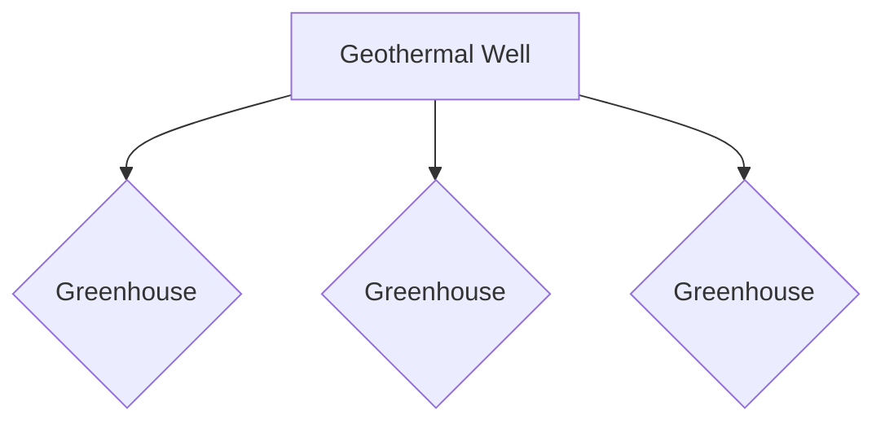
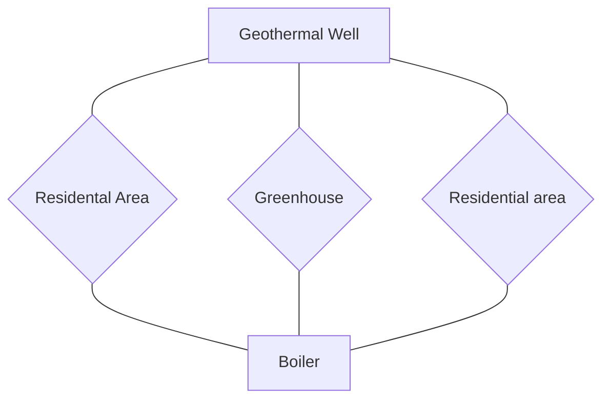
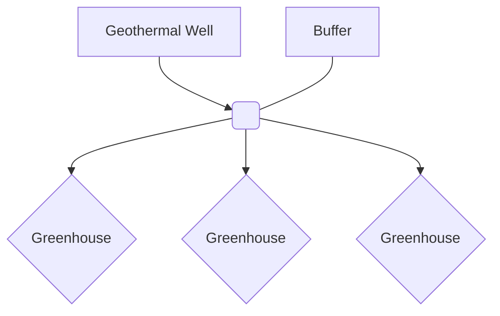

## WarmingUP Test Cases

This file lists all the test cases from WarmingUP.

### 1a

Geothermal well providing for greenhouse baseloads in a tree network.

### 2a

Geothermal well and boiler providing for greenhouses and residential areas in a ring network.

### 3a

Geothermal well with storage providing for greenhouses in a tree network.

