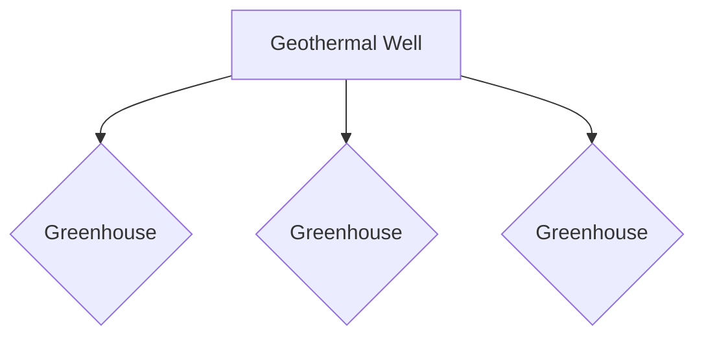

## WarmingUP Test Cases

This file lists all the test cases from WarmingUP.

### 1a

Geothermal well providing for greenhouse baseloads in a tree network.

```mermaid
graph TD
    S[Geothermal Well] --> D1{Greenhouse}
    S --> D2{Greenhouse}
    S --> D3{Greenhouse}
```
